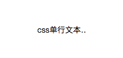
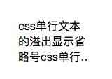

# CSS实现单行多行添加省略号
先介绍一下单行文本添加省略号的css代码

以下代码实现的效果为下图
```
overflow: hidden;
text-overflow:ellipsis;
white-space: nowrap;
```

先介绍一下多行文本添加省略号的css代码

以下代码实现的效果为下图
```
display: -webkit-box;
-webkit-box-orient: vertical;
-webkit-line-clamp: 3;
overflow: hidden;
```


先介绍一下多行文本添加省略号的css代码的优化

以下代码实现的效果为下图
```
div{position: relative; line-height: 20px; max-height: 40px;overflow: hidden;}
div::after{content: "..."; position: absolute; bottom: 0; right: 0; padding-left: 40px;
background: -webkit-linear-gradient(left, transparent, #fff 55%);
background: -o-linear-gradient(right, transparent, #fff 55%);
background: -moz-linear-gradient(right, transparent, #fff 55%);
background: linear-gradient(to right, transparent, #fff 55%);
}
```
