# sublime 插件

### 下载：

   https://www.sublimetext.com/3  //下载网址，可以选择版本 sublime Text3    以dmp结尾的

### 删除插件：

   1. command+shift+P,输入package
   2. 查找remove package
   3. 输入你要删除的package
   4. 回车，OK

### 安装插件:

    1. 安装 Package Control   http://www.jianshu.com/p/5baa47642375 (利用Package Control来安装其他插件)

    2. 上面的 Package Control 安装完以后, 就可以通过快捷键 command + shift + p 并输入 install package, 来选择需要安装的插件.

    3. 插件有时默认的快捷键会和其他的软件的快捷键冲突，所以可以自己设置插件的快捷键
     点击菜单 Preferences -> KeyBindings - User, 加入如下内容
     [{ "keys": ["ctrl+1"], "command": "alignment" }]
     将快捷键修改成自己要改的。

### Sublime Text常用插件总结:

     我认为插件比较官方了解可以参考此链接：https://packagecontrol.io/packages/Babel
     后面换上不同的插件名称即可，不过可能只是大致介绍一些基础重要的。

**1.) Emmet**

     Emmet使用仿CSS选择器的语法来生成代码，大大提高了HTML/CSS代码编写的速度。 具体使用链接：http://www.iteye.com/news/27580  (桌面有两个我写的文件,不过对js和less没有作用)

**2.)Alignment**

 这插件用于对齐代码赋值语句，如
  ```
  var name = "sublimt"
  var version = "2.0.1"
  var title = "sublime text
  ```
 按下快捷键后, 会变成:
  ```
  var name    = "sublimt"
  var version = "2.0.1"
  var title   = "sublime text”
  ```
**3.)Trimmer**

   你知道当你编写代码时，由于错误或别的某些原因，会产生一些不必要的空格。需要注意的是多余的空格有时也会造成错误。这个插件会自动删除这些不必要的空格，也可以删除空行，可以达到压缩css和js的效果。

**4.)autoprefixer**

  自动在代码前面添加兼容性前缀

  例子：
  ```
     使用前：
     .wsl{
         display:flex;
         -webkit-border-radius:20px;
          border-radius:20px;
       }
     使用后：
     .wsl{
        display:-webkit-box;
        display:-ms-flexbox;
        display:flex;
        border-radius:20px;
     }
 ```
注释：效果明显，多于的 CSS/less 会自动删掉，border-radius 早就已经不需要前缀了，只有 Firefox 3.6，Chrome 4，Safari 4 和 Android 2.1 需要前缀；

快捷键设置方式还是如上第三步所示：

  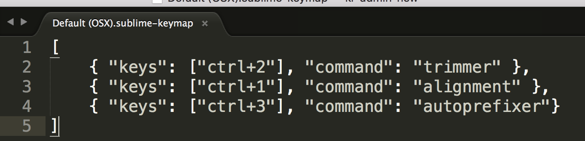


**5.)Less**

      功能：LESS高亮插件
      简介：用LESS的同学都知道，sublime没有支持less的语法高亮，所以这个插件可以帮上我们
      使用：打开.less文件或者设置为less格式
      //在没安装这个插件之前less文件中的代码是白色的，看着很不舒服，安装了这个插件则会让代码加上颜色

**6.)Babel**

    这个插件支持ES6， React.js, jsx代码高亮，对 JavaScript, jQuery 也有很好的扩展。
    按照上述步骤安装后，在view->Syntax(语法)->这个时候安装了babel就会有一项选择Babel->Babel(javascript)这一项，代码就会变高亮。 （默认是Syntax下面的javascript）。

**7.)BracketHighlighter**

   1. BracketHighlighter插件能为Sublime Text提供括号，引号这类高亮功能，但安装此插件后，默认没有高亮，只有下划线表示，不是很醒目，跟进一步的修改可以

   http://www.wdclab.com/2015/09/10/mac%E7%89%88sublime-text-3%E4%B8%ADbrackethighlighter%E6%8F%92%E4%BB%B6%E9%AB%98%E4%BA%AE%E8%AE%BE%E7%BD%AE%E6%96%B9%E6%B3%95/   (mac)

   http://www.cnblogs.com/willingtolove/p/4657320.html       (windows)

   2. 可以参考此链接 ,很有用,执行完第二步是白色高亮

   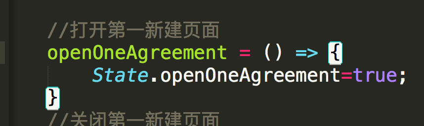

   3. 若想彩色高亮则根据步骤继续进行第三步。

   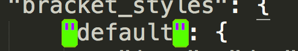,

   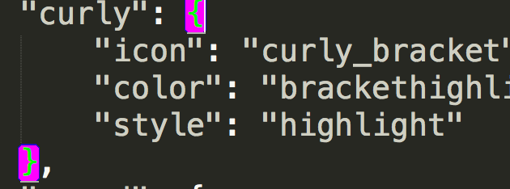

  ```
  Bracket Quote 表示引号     
  Bracket Tag   表示标签
  Bracket Angle 表示角 （这个可以自己试试）
  Bracket Square 表示方括号
  Bracket Round  表示小括号
  Bracket Curly  表示大括号
 不过实现彩色的效果还需要安装SublimeLinter
```

#### {主题相关插件8-9}
**8.)Theme-Soda**

 Soda主题是sublime上一款很著名的清爽型主题，分两种：

 `light:`

 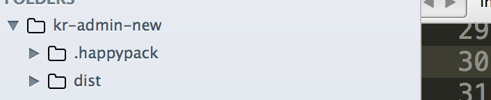

  `dark:`

 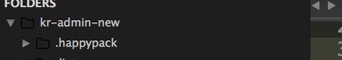


 `两者之间的切换通过在 （菜单 Preferences -> Settings - User）中加入 "theme": "Soda Light.sublime-theme" 或 "theme": "Soda Dark.sublime-theme”`

 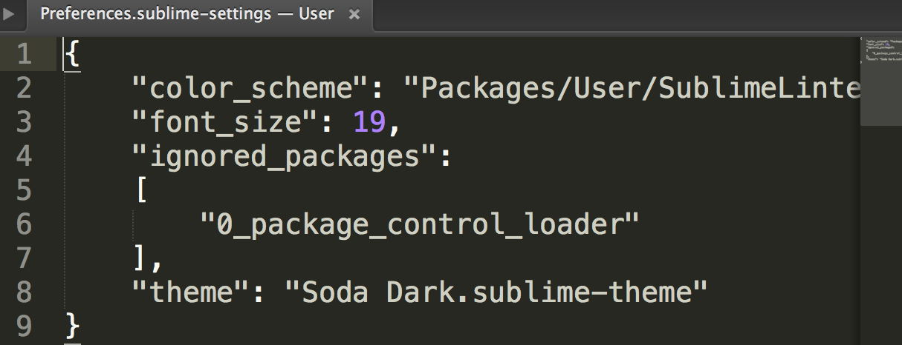

 `如果想要原来默认的则去掉这句话不写即可，默认：`

 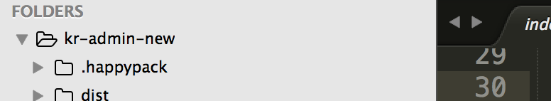

保存之后发现怎么代码区域还是黑色的背景，菜单栏颜色已经切换了，别急，这里还少了一步，就是配置一下color scheme,就用下面的插件介绍


**9.)ColorSublime**
 ```
  主题可以参考此链接： http://www.jianshu.com/p/13fedee165f1
  主要以ColorSublime为插件安装
  安装了ColorSublime后，在控制面板里输入安装ColorSublime:install theme
  就可以如链接所示，选择你相中的主体安装
```

#### {文件模版10}
**10.)SublimeTmpl**

http://www.fantxi.com/blog/archives/sublime-template-engine-sublimetmpl/    
只看使用，安装就行，Sublime Text 新建文件的模版插件

#### {JS代码格式化11}
**11.)JsFormat**

  这是一款将JS格式化的插件，安装后即可在JS文件中通过鼠标右键->JsFormat或键盘快捷键Ctrl+Alt+F对JS进行格式化

#### {右键菜单功能增强插件12}
**12.)SideBarEnhancements**

  这是一款很实用的右键菜单增强功能，安装之前左侧菜单栏右键只有几个功能，安装之后增加了很多实用功能。
  可以参考这个链接，有个简单的说明：https://nicesu.gitbooks.io/sublime-text-guide/content/plug-in/sidebarenhancements.html


#### {只针对.css的文件代码排序13}
**13.)CSScomb**
 `格式化前：`

 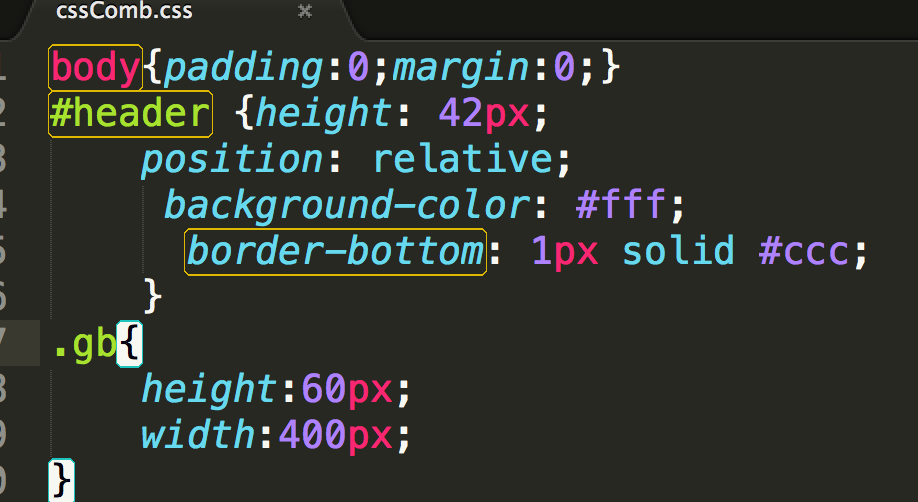,

 `格式化后：快捷键 ctrl+shift+c`

 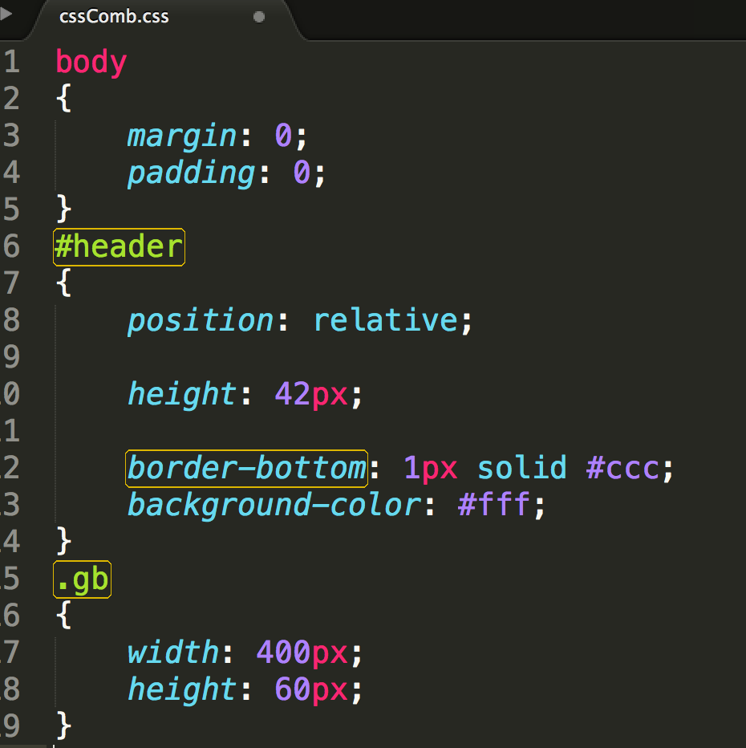,

 但是会产生一些空行，可以解决:
 在sublime中下载` CSS Format `插件，然后执行 edit->css format->expanded 即可此   时空行将会消除。

 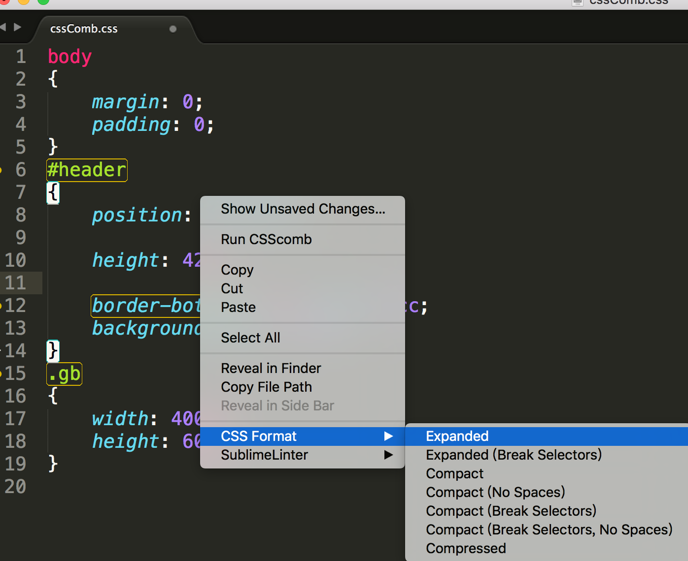,

`我认为可以先用css最后可以改成less文件可以参考这个链接：https://segmentfault.com/a/1190000004577644`


#### {文件中打开命令行窗口14}
**14.)Terminal**
```
 在编程过程中我们需要经常使用到命令行窗口，此快捷键可以在sublime Text3中打开cmd窗口，默认打开的是终端，如果想要打开iTerm,可以在setting->user中设置：
 快捷键（mac）:cmd+shift+t
 可以参考链接：https://packagecontrol.io/packages/Terminal
```

### {查看html、css兼容的15}
**15.)Can I Use**

不过只是针对html和css，选中一个词或标签按快捷键：ctrl+alt+f就会跳到http://caniuse.com/，可以看到兼容到哪些浏览器


### {代码校验16}
**16.)SublimeLinter**

  SublimeLinter是一个代码校验插件，它可以帮你找出错误或编写不规范的代码
  会在页面上产生一些点，点击点会有提示在下方
  可以按照这个安装：  

  http://www.cnblogs.com/xiaofeixiang/p/4853625.html

  可以通过这个研究：

  https://nicesu.gitbooks.io/sublime-text-guide/content/plug-in/sublimelinter.html

  **(但是不知道怎么把下面提示区域放大？)**


####{在文件中调用Git命令17}
**17.)Git**

   可以参考此链接：https://packagecontrol.io/packages/Git
   安装完git后可以在mac中用命令打开：cmd+shift+p，输入git就会出现很多git命令。

 **(但是git status可以用，其他的怎么用？)**
