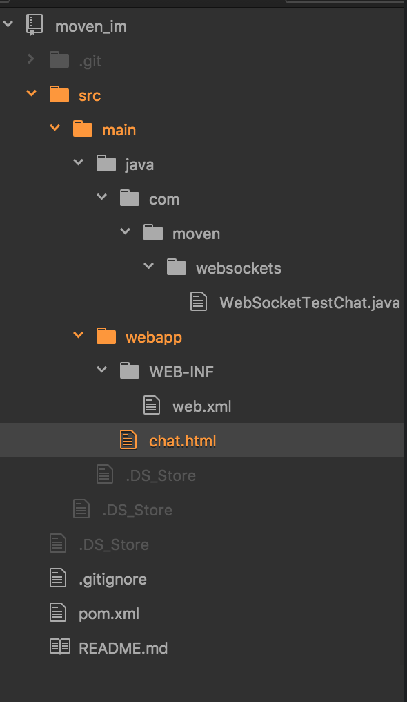

# webSocket
####目录结构如下



#####WebSocketTestChat.java里的代码:
```
package com.moven.websockets;

import java.io.IOException;
import java.util.Set;

import javax.servlet.http.HttpSession;
import javax.websocket.OnClose;
import javax.websocket.OnError;
import javax.websocket.OnMessage;
import javax.websocket.OnOpen;
import javax.websocket.Session;
import javax.websocket.server.PathParam;
import javax.websocket.server.ServerEndpoint;

@ServerEndpoint("/chat/{username}")
public class WebSocketTestChat {
	Set<Session> session_list = null;

	@OnMessage
	public void onMessage(String message, Session session) {
		try{
			session_list = session.getOpenSessions();
			HttpSession httpSession = null;
			String username = "";
			if(session instanceof HttpSession){
				httpSession = (HttpSession)session;
				Object param = httpSession.getAttribute("username");
				if(null != param){
					username = param.toString();
				}
			} else {
				username = session.getId();
			}
			for (Session s : session_list) {
				s.getBasicRemote().sendText("当前总人数[" + session_list.size() + "]---" + username + "说:" + message);
			}
		} catch(IOException e){
			System.out.println("Client error");
		}
	}

	@OnError
    public void onError(Throwable t) throws Throwable {
		System.out.println("Client error = "+t.getMessage());
    }

	@OnOpen
	public void onOpen(@PathParam("username") String username, Session session) {
		HttpSession httpSession = null;
		if(session instanceof HttpSession){
			httpSession = (HttpSession)session;
			httpSession.setAttribute("username", username);
		}
		System.out.println("Client connected");
	}

	@OnClose
	public void onClose() {
		System.out.println("Connection closed");
	}

}

```
#####chat.html里边的代码
```
<!DOCTYPE html>
<html>
<head>
<title>Testing websockets</title>
</head>
<body>
	<div>
		<textarea name="text" id="text" rows="3" cols="20"></textarea>
		<input type="submit" value="send" onclick="start()" />
	</div>
	<div id="messages"></div>
	<script type="text/javascript">
		var webSocket = new WebSocket(
				'ws://local.moven.cn:8081/moven_im/chat/msw/lyh');

		webSocket.onerror = function(event) {
			onError(event)
		};

		webSocket.onopen = function(event) {
			onOpen(event)
		};

		webSocket.onmessage = function(event) {
			onMessage(event)
		};

		function onMessage(event) {
			document.getElementById('messages').innerHTML += '<br />'
					+ event.data;
		}

		function onOpen(event) {
			document.getElementById('messages').innerHTML = 'Connection established';
		}

		function onError(event) {
			alert(event.data);
		}

		function start() {
			var text = document.getElementById('text').value;
			if(text){
				webSocket.send(text);
			} else {
				alert("Message can't be null");
			}
			document.getElementById('text').value = '';
			return false;
		}
	</script>
</body>
</html>

```
#####web.xml里边的代码
```
<?xml version="1.0" encoding="UTF-8"?>
<web-app xmlns:xsi="http://www.w3.org/2001/XMLSchema-instance"
	xmlns="http://java.sun.com/xml/ns/javaee" xmlns:web="http://java.sun.com/xml/ns/javaee/web-app_2_5.xsd"
	xsi:schemaLocation="http://java.sun.com/xml/ns/javaee
	http://java.sun.com/xml/ns/javaee/web-app_3_0.xsd"
	id="WebApp_ID" version="3.0">

	<display-name>Simple web application</display-name>

</web-app>
```
#####pom.xml里边的代码
```
<project xmlns="http://maven.apache.org/POM/4.0.0" xmlns:xsi="http://www.w3.org/2001/XMLSchema-instance"
	xsi:schemaLocation="http://maven.apache.org/POM/4.0.0 http://maven.apache.org/xsd/maven-4.0.0.xsd">
	<modelVersion>4.0.0</modelVersion>
	<groupId>com.moven</groupId>
	<artifactId>moven_im</artifactId>
	<version>1.0-SNAPSHOT</version>
	<packaging>war</packaging>

	<properties>
		<project.build.sourceEncoding>UTF-8</project.build.sourceEncoding>
	</properties>

	<build>
		<plugins>
			<plugin>
				<groupId>org.apache.maven.plugins</groupId>
				<artifactId>maven-compiler-plugin</artifactId>
				<configuration>
					<source>1.7</source>
					<target>1.7</target>
				</configuration>
			</plugin>
		</plugins>
	</build>

	<dependencies>
		<dependency>
			<groupId>javax</groupId>
			<artifactId>javaee-api</artifactId>
			<version>7.0</version>
			<scope>provided</scope>
		</dependency>
	</dependencies>
</project>

```
