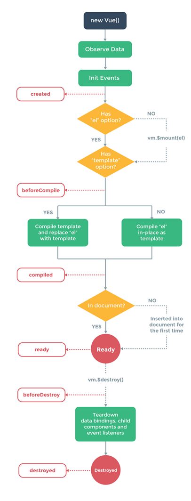

# vue生命周期
###下面的表格是1.0+版本与2.0+版本的对比
|vue1.0+|vue2.0|解释|
|-----|-----|:-----:|
|init|beforeCreate|组件实例刚被创建，组件属性计算之前，如data属性|
|created|created|组件实例创建完成，属性已绑定，但DOM还没生成,$el属性还不存在|
|beforeCompile|beforeMount|模板编译/挂载之前|
|compiled|mounted|模板编译/挂载之后|
|ready|mounted|模板编译/挂载之后|
|-|beforeUpdate|组件更新之前|
|-|updated|组件更新之后|
|-|activated|for keep-alive，组件被激活时调用|
|-|deactivated|for keep-alive，组件被移除时调用|
|activated|-|不做解释|
|detached|-|不做解释|
|beforeDestroy|beforeDestroy|组件销毁前调用|
|destroyed|destroyed|组件销毁后调用|
###用代码说清这些
```
<!DOCTYPE html>
<html>
<head>
    <title></title>
    <script type="text/javascript" src="https://cdn.jsdelivr.net/vue/2.1.3/vue.js"></script>
</head>
<body>

<div id="app">
     <p>{{ message }}</p>
</div>

<script type="text/javascript">

  var app = new Vue({
      el: '#app',
      data: {
          message : "xuxiao is boy"
      },
       beforeCreate: function () {
                console.group('beforeCreate 创建前状态===============》');
               console.log("%c%s", "color:red" , "el     : " + this.$el); //undefined
               console.log("%c%s", "color:red","data   : " + this.$data); //undefined
               console.log("%c%s", "color:red","message: " + this.message)  
        },
        created: function () {
            console.group('created 创建完毕状态===============》');
            console.log("%c%s", "color:red","el     : " + this.$el); //undefined
               console.log("%c%s", "color:red","data   : " + this.$data); //已被初始化
               console.log("%c%s", "color:red","message: " + this.message); //已被初始化
        },
        beforeMount: function () {
            console.group('beforeMount 挂载前状态===============》');
            console.log("%c%s", "color:red","el     : " + (this.$el)); //已被初始化
            console.log(this.$el);
               console.log("%c%s", "color:red","data   : " + this.$data); //已被初始化  
               console.log("%c%s", "color:red","message: " + this.message); //已被初始化  
        },
        mounted: function () {
            console.group('mounted 挂载结束状态===============》');
            console.log("%c%s", "color:red","el     : " + this.$el); //已被初始化
            console.log(this.$el);    
               console.log("%c%s", "color:red","data   : " + this.$data); //已被初始化
               console.log("%c%s", "color:red","message: " + this.message); //已被初始化
        },
        beforeUpdate: function () {
            console.group('beforeUpdate 更新前状态===============》');
            console.log("%c%s", "color:red","el     : " + this.$el);
            console.log(this.$el);   
               console.log("%c%s", "color:red","data   : " + this.$data);
               console.log("%c%s", "color:red","message: " + this.message);
        },
        updated: function () {
            console.group('updated 更新完成状态===============》');
            console.log("%c%s", "color:red","el     : " + this.$el);
            console.log(this.$el);
               console.log("%c%s", "color:red","data   : " + this.$data);
               console.log("%c%s", "color:red","message: " + this.message);
        },
        beforeDestroy: function () {
            console.group('beforeDestroy 销毁前状态===============》');
            console.log("%c%s", "color:red","el     : " + this.$el);
            console.log(this.$el);    
               console.log("%c%s", "color:red","data   : " + this.$data);
               console.log("%c%s", "color:red","message: " + this.message);
        },
        destroyed: function () {
            console.group('destroyed 销毁完成状态===============》');
            console.log("%c%s", "color:red","el     : " + this.$el);
            console.log(this.$el);  
               console.log("%c%s", "color:red","data   : " + this.$data);
               console.log("%c%s", "color:red","message: " + this.message)
        }
    })
</script>
</body>
</html>
```

###附一张图后面慢慢理解


